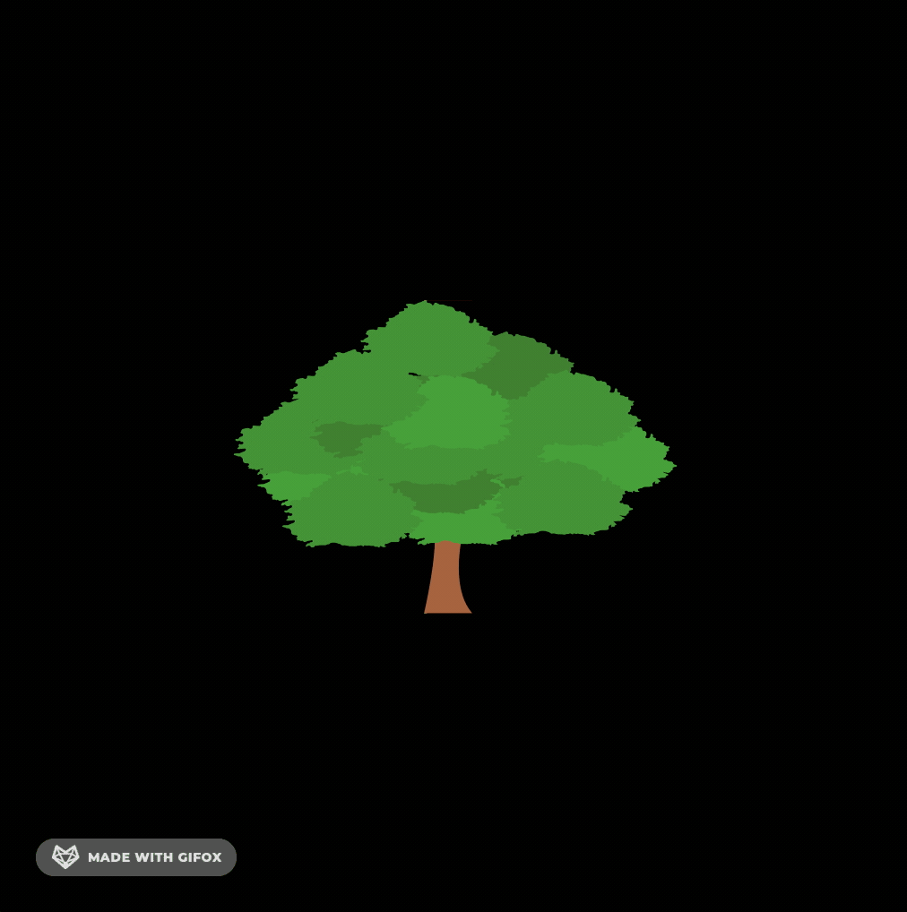

OpenGL wrapper with additional libraries such as: stb, glfw, freetype2.
Written in the style of STL.

### Example code
```C++
#include <iostream>

#include <gl/gl.hpp>


int main() {
	gl::window w;
	w.set_title("example");
	w.set_size(gl::size(512, 512));
	w.set_resize(true);
	w.show();

	gl::image i(
		gl::size(2.0, 2.0),
		gl::color(1.0, 1.0, 1.0),
		gl::coordinates(-1.0, 1.0),
		"tree.png"
	);

	w.scale(gl::coordinates(0.5, 0.5, 0.5));
	while (w.is_action()) {
		w.clear();
		w.rotate(1, true, false, false);

		i.draw();

		if (w.is_pressed('Q')) {
			break;
		};

		w.update();
	};

	return 0;
};
```


